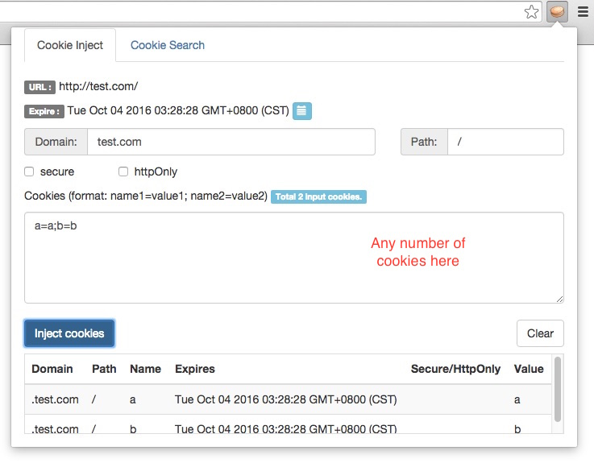
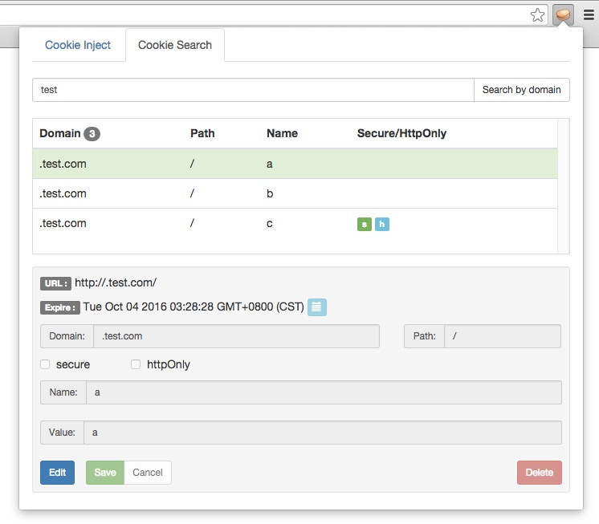
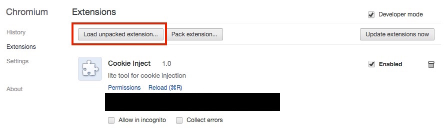

# cookie-inject-extension-on-chrome
An extension that modifies cookies on chrome/chromium.

## Before you use it
Cookies are supposed to be private and should never be placed in danger.

This extension would directly read/modify cookies on your browser.

People may feel unsafe about it because it's written by some guy that u don't even know about.

One thing is sure: you use it, you take all the risks...  :)

## Demo
* Cookie inject

* Cookie search/edit

* Easy install on chrome/chromium

## Copyright

Copyright 2015 lngost

See <https://github.com/lngost>

## License
This program is free software: you can redistribute it and/or modify
it under the terms of the GNU General Public License as published by
the Free Software Foundation, either version 3 of the License, or
(at your option) any later version.

This program is distributed in the hope that it will be useful,
but WITHOUT ANY WARRANTY; without even the implied warranty of
MERCHANTABILITY or FITNESS FOR A PARTICULAR PURPOSE.  See the
GNU General Public License for more details.

You should have received a copy of the GNU General Public License
along with this program.  If not, see <http://www.gnu.org/licenses/>.

